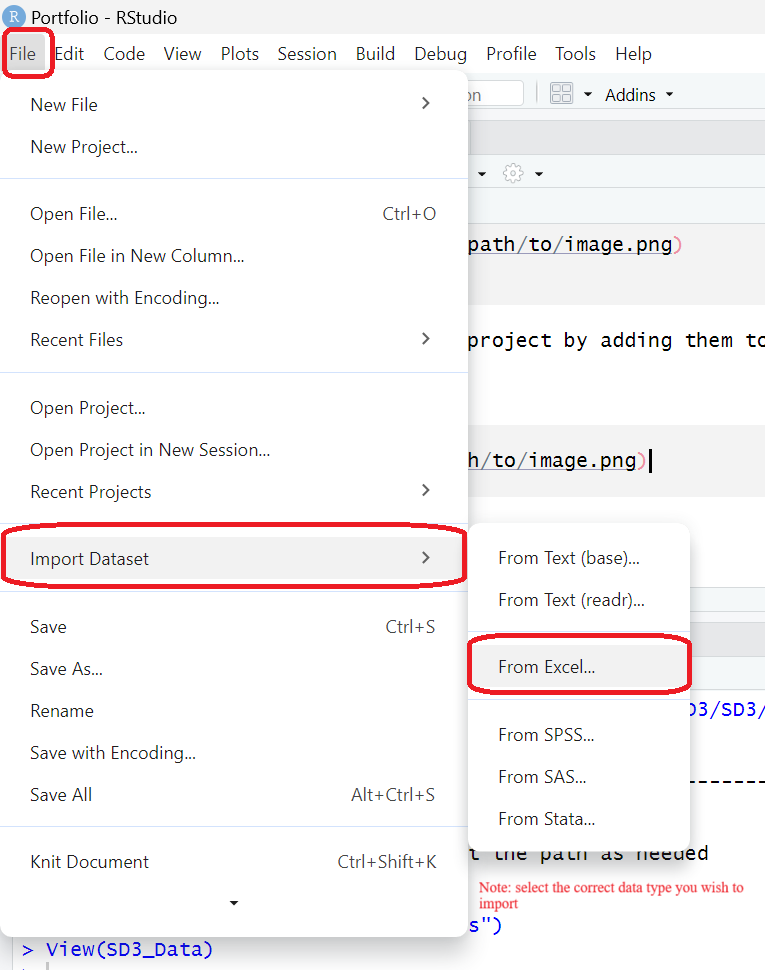
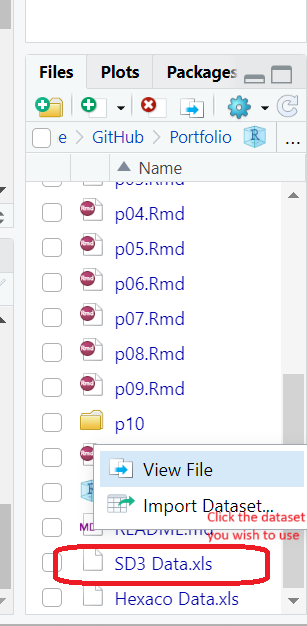

# Project Description 

This project will produce a HTML that documents my process of learning to utilize R more fluidly. My goals are to 1) learn how to import a new dataset, 2) practice cleaning and scoring data, 3) run analyses 4) create figures and 5) interpret simple correlations. Ultimately, I hope that this will provide the opportunity to practice and improve upon skills covered in the course's labs so far.  

The data being used for this project is from the Open-Source Psychometrics Project, a website that offers psychometric assessments and provides raw data for public edification. Specifically, I will be utilizing data from the Short Dark Triad (SD3) (Paulhus and Jones, 2011) and the HEXACO Personality Inventory (Lee and Ashton, 2004). These measures were chosen as they are key constructs used in my thesis. adhttps://openpsychometrics.org/_rawdata/

# Aim 1: Importing Data

Option 1: File > Import Dataset > Select file type (here I chose Excel)


Option 2: To link data sets to project by adding them to the GitHub file for the project > Click on data and click import data set



Load libraries 
```{r libs}
library(tidyr)
library(dplyr)
library(readxl)
```

Load Data 
```{r loadingdata}
library(readxl)
Hexaco_Data <- read_excel("Hexaco Data.xls")
```

```{r loadingdata2}
library(readxl)
SD3_Data <- read_excel("SD3 Data.xls")
```

# Aim 2: Cleaning and Scoring

```{r HexacoHH}
HHData <- Hexaco_Data %>% 
  select(HSinc1:HSinc10, HFair1:HFair10, HGree1:HGree10, HMode1:HMode10)
```
Note: This allows you to create a new dataset based on the variables in the select function 

```{r HHAvgsworking}
HHAvgsWorking <- HHData %>%
  mutate(
    HSincAvg = rowMeans(across(HSinc1:HSinc10), na.rm = TRUE),
    HFairAvg = rowMeans(across(HFair1:HFair10), na.rm = TRUE),
    HGreeAvg = rowMeans(across(HGree1:HGree10), na.rm = TRUE),
    HModeAvg = rowMeans(across(HMode1:HMode10), na.rm = TRUE),
    HHAvg = rowMeans(across(HSinc1:HMode10), na.rm = TRUE))
```
Note: Creating new variables based on values for specified columns per observation#

```{r HHAvgs}
HHAvgs <- HHAvgsWorking %>%
  select(HSincAvg, HFairAvg, HGreeAvg, HModeAvg, HHAvg)
```

Note: Creating dataset that includes only specified variables  

```{r peak1}
glimpse(HHAvgs)
```
Note: Taking a peak at data structure


```{r SD3working}
SD3AvgsWorking <- SD3_Data %>%
  mutate(
    MAvg = rowMeans(across(M1:M9), na.rm = TRUE),
    NAvg = rowMeans(across(N1:N9), na.rm = TRUE),
    PAvg = rowMeans(across(P1:P9), na.rm = TRUE),
    DTAvg = rowMeans(across(M1:P9), na.rm = TRUE))
```

```{r SD3Avgs}
SD3Avgs <- SD3AvgsWorking  %>%
  select(MAvg, NAvg, PAvg, DTAvg)
```

```{r peak2}
glimpse(SD3Avgs)
```
# Aim 3: Run Analyses
Correlate between each of the Dark Triad components and each other (3x3) and the DT components and the total DT score. 

```{r install}
install.packages("Hmisc")
```

```{r}
library(Hmisc)
rcorr(as.matrix(SD3Avgs))
```
Note: rcorr makes a corr matrix of both r and p values 

```{r}
library(Hmisc)
rcorr(as.matrix(HHAvgs))
```

# Aim 4: Figures
```{r}
library(ggplot2)
library(tidyr)
```


```{r reshape}
SD3Long <- SD3Avgs %>%
  pivot_longer(cols = c("MAvg", "PAvg", "NAvg"), names_to = "Subcomponent", values_to = "Value"
  )

```

```{r}
install.packages("viridis")
```
```{r}
library(viridis)
```


```{r}
ggplot(SD3Long,
       aes(x = DTAvg, 
           y = Value, color = Subcomponent)) +
  geom_point()+
  labs(title = "DT by Subcomponents", x = "DT Average", y = "Value", color = "Subcomponent" ) + 
  scale_color_viridis_d()
```
```{r}
install.packages("corrplot")
```

```{r}
library(corrplot)
```

```{r}
corrplot(cor(SD3Avgs))
```


```{r plottingmandp}
ggplot(SD3Avgs,
       aes(x = MAvg, 
           y = PAvg)) +
  geom_point()+
  labs(title = "Machiavellianism by Psychopathy", x = "Mach Average", y = "Psych Avg")
```

```{r plotingpandn}
ggplot(SD3Avgs,
       aes(x = PAvg, 
           y = NAvg)) +
  geom_point()+
  labs(title = "Psychopathy by Narcissism", x = "Psych Average", y = "Narc Avg")
```

```{r plottingmandn}
ggplot(SD3Avgs,
       aes(x = MAvg, 
           y = NAvg)) +
  geom_point()+
  labs(title = "Machiavellianism by Narcissism", x = "Mach Average", y = "Narc Avg")
```

# Aim 5: Interpretation


